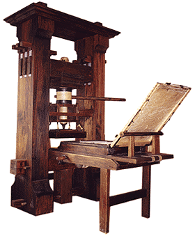

Continuing from Egyptians and cave men we move into the Middle ages where we see the most significant change in typography.

The Middle Ages were all about handwritten and well-illustrated and printed manuscripts which in turn led to the development of a wider range of writing styles; including calligraphy and page layout. Many new typefaces were created during this time due to the increased interest in reading and writing carrying on from the Roman times.

The next most significant changing point of the Middle Ages. This was when Johannes Gutenberg invented the moveable printing press in around 1440s which opened the ability to compose single glyphs into longer lines of text allowing more words to be typed at any one time. This development led to publications being able to be printed on a larger scale which meant that education could be open to more people due to educational books being printed for the first time. News could be created and read on a widespread scale due to newspapers being printed in larger quantities allowing papers to be sold on a larger scale opening a new market.

In the late 1400s a Frenchman, Claude Garamond created the first typeface that wasn’t designed to imitate handwriting but to create lettering based upon geometric shapes, not only did he make this change he also started the tradition of naming the typefaces created after himself.

By the early 1500s a gentleman, Aldus Manutius invented the idea of a portable book due to the public's increased interests in reading. He then moved onto creating the first italic typeface which was still one the of the first few typefaces to have been created.

As a result of Gutenberg’s earlier success of creating the moveable printing press - a typeface was created and named after him to be used in the world’s first printed book – The Gutenberg Bible. Based upon other typefaces that had condensed counters which meant the words took up less space resulting in increased spacing on the page, allowing for more words per page.

The final most significant change within typography in the Middle Ages was the use of typography for advertisements using both initial serif and sans serifs typefaces. This led to a development for local businesses as well as promoting the use and development of the new typefaces. In the next blog post we will be continuing along the typography timeline to the 1700/1800s.