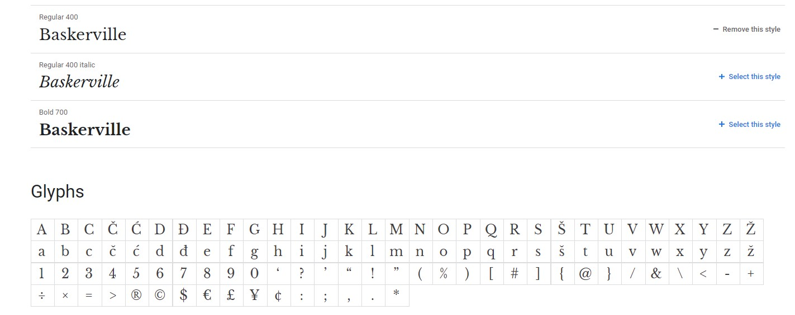

Continuing through time we move onto the changes within the 17/1800s, including royal orders and new typefaces created…

At the end of the 16th century Louis XIV ordered for a creation of a new type that was composed of letters that had been created through ‘scientific’ principles. Phillipe Grandjean was selected to produce this commission, he used a basic design and cut a type that drove Garamond – the most popular type at that time out of its top position.

The new type was known as Romain du Roi and it was first used in 1702. This new type was most liked for its regularity and precision along with the addition of flat serifs. Although this type was only intended for royal usage other creatives took it upon themselves to copy similar fonts to accessed for commercial use.

Up until the 17th century three major typefaces had been developed; Roman, italic and gothic. Robert Granjon tried to create a fourth major typeface, Civilite. He planned for this to be a national typeface for French printers however this did not work out instead it was only used as a display face and was not used in the printing of books.

In 1734 created a typeface based upon Garamond’s version of the Aldine Roman. The letters were well balanced, well cut and they made a font that was easy to read and highly liked by many.

The next most significant change to typography happened about a quarter of a century later by John Baskerville, who introduced the first transitional roman typeface. This type showed a greater care for how the font looks with an increased contrast between thick and thin lines as well as sharp serifs.

By 1780 Bodoni developed the first modern roman typeface, he was the very first to attempt such dramatic changes within the line contrasts and although his pages of type were not easy to read, he still became a significant figure in the historical timeline from old type to modern type.

Moving into the 18th century we had significant developments around serifs. In 1815 Vincent Figgins developed a typeface that had square serifs which is now more commonly known as slab serifs. Whilst in the following year William Caslon IV produce the very first typeface without any serifs, this was the development of sans serif however despite being popular today, however in 1800s this style was highly frowned upon.

In the next post we will move into the 19th century where we look into how typefaces became more modern and how we know it today.