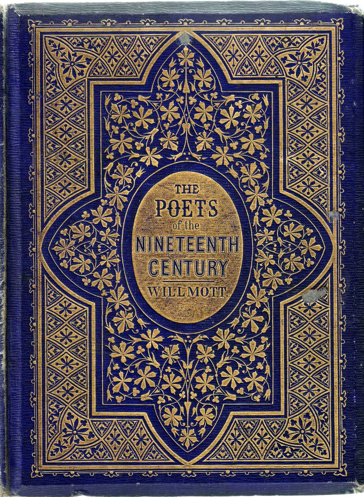

Continuing from the 18th century we are going to explore the early 19th century …

Type and book design had two major changes in the early 19th century, one technical and one aesthetic. Starting with the technological we delve into the development of the mechanical composition press which has led to how our books look today in the 21st century.

As with many industries at the time, the Industrial revolution led a major turning point in printing not only by making it a worthwhile trade but by creating a larger market for the products to be sold or bought into. With trade on the rise inventors were developing products that had never been imagined before, as a result they were set the task to find a solution to the ever growing problems with large printing productions including paper production, page composition, printing and binding in order to supply the needs of an increasingly literate population.

According to Britannica 2020, the solution that was known to make the most change to the appearance of the book was the ‘mechanical composition; the new composing machines that set new limits on type design and type faces’. Due to these new possibilities the Victorians with their well-known elaborate designs and colours took utilized this development to have not one or two but multiple typefaces within a book!

An influential person of that time was William Morris who despite already being a successful writer decided due to his love of decoration and beauty set up his own press. He was fascinated with the design of early fonts and proposed to the well know printer Emery Walker that he wished to cut a new font based upon the ‘strength and beauty of the early letters’, Britannica 2020. With the help of Walker, he created one Roman typeface based upon one previously created by Nicolas Jenson and two Gothic typefaces based upon German typefaces. Although the press only had a brief life in its time it created one of the most influential books in the history of printing, Chaucer.  Morris’ creation was the one of the first private presses which influenced the start of the ‘Private press movement’.

In the next blog post we will look into the importance of the ‘Private press movement’ both in the UK and internationally.