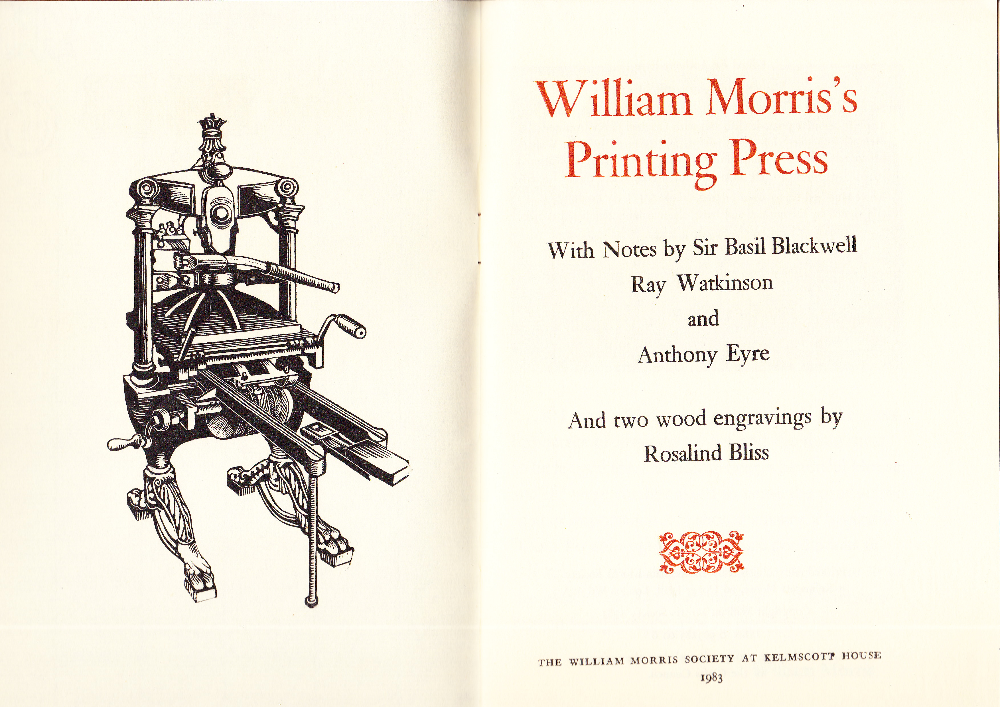
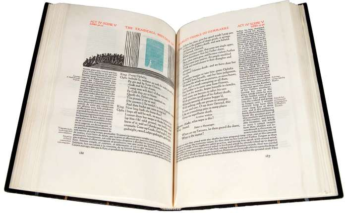

In this blog post we will be looking into the second major change in the early 19th century, the ‘Private press movement’, mentioned briefly in the previous post…

Previously we mentioned that William Morris was highly influential setting up one of the first private presses in the UK which then set off a huge increase in private presses being set up. However, it was also seen that this growth wasn’t just nationally based but grew internationally in particular; Germany, Scandinavian countries and in the United States. The best of these imitations according to Britannica ‘the Doves and Ashendene presses in England’ and ‘the Bremer and Cranach presses in Germany’.

We are going to look into the Doves as our UK press example set up in 1900 by Emery Walker (mentioned in the previous post) and T.J Cobden-Sanderson. Both gentlemen were also involved with other presses, Walker at Ashendene and Sanderson at Morris’ as a bookbinder. Sanderson was well-known for his bookbinding abilities and the books that he bound at Doves press are known for their brilliant craftsmanship and simple design.

All the books printed by Doves press were printed in a type based on Jenson’s roman typeface. When printing their books, they deliberately avoided all decoration and illustration to remain dependent on the beauty of their typography, layout and composition to complement the books content. The press really wanted to show their ability for perfect craftmanship without adding lots of colours, engravings and illustrations.

Moving onto international presses we will look at Bremer run by Willy Wiegand much like Doves press disliked the use of decorative pieces and likewise chose carefully the typefaces being used and the precision within their presswork to make a statement. On the other hand, the most modernistic press in Germany around this time was Cranach which products editions of classic literature pieces beautifully illustrated by renowned artists such as Aristide Maillol and Gordon Craig. These were then typed based on typefaces by Emery Walker on handmade paper from France making the whole print making process were international with German painters, British typefaces and French paper.

Overall the Private press movement allowed for individuals to grow and create a press based on their own abilities and visions which in turn showed a change in how books were to be printed in the future, in particular the Cranach press shows a glimpse of how printing and typography works now in the 21st century.