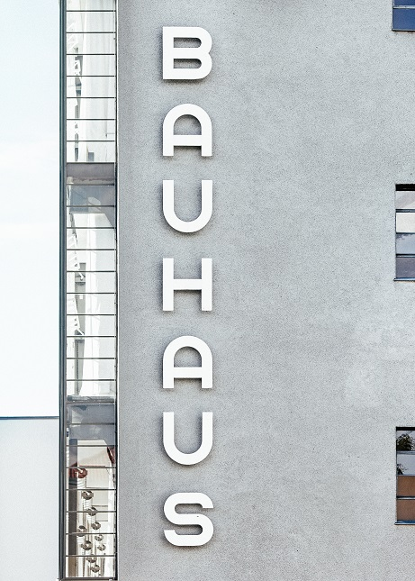

The early 1900s saw the development of modern typography this was a time where the visual look of typography became of new importance and art began to take a role within the printing industry. The period when typography went from being very differentiated from different printers to the move towards more universally created publications.

One of the most memorable and influential people of this time was the last Bauhaus student, Herbert Bayer. He worked hard not just in typography but with other creative areas such as architecture. He is recognized mostly for the development of his typeface, Universal. He adopted the use of reductive minimalism – a reductive style that only uses simple patterns and rhythms, to develop his famous sans serif typeface which was one of the key influences that defined the Bauhaus look.

The Bauhaus founded by Walter Gropius was a German art school that operated from 1919 to 1933. The school became famous for its unique approach which worked towards combining aesthetics within everyday functions.

Bauhaus types have influenced many great artists such as Jan Tschichold who created visual art within books that meant book lovers could now see art in books even just by looking at a letter. This development came about after he visited a Bauhaus exhibition in 1924, according to Widewalls, 2020 he adopted the composition, structure and geometry of the Bauhaus type. His most important work following this inspiration was the Die Neue Typographie – The New Typography, created in 1928 it was one of many books that set the way for more universal and modernistic communication.