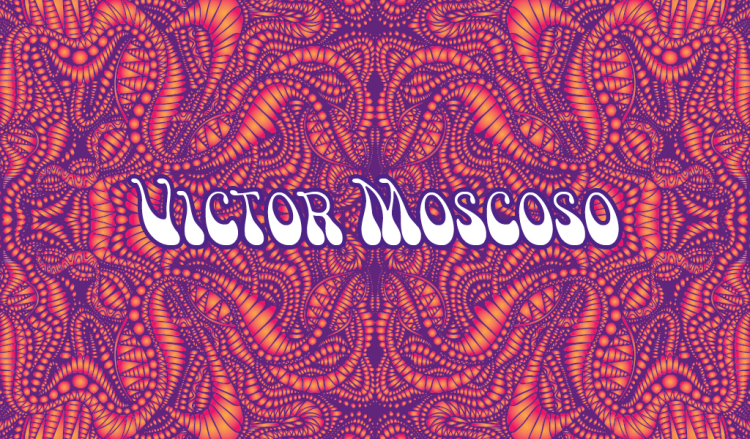

We move swiftly into the 1960s, the time of huge changes within society and therefore as a result typography/art.

The 1960s was the start of the peace movement and the psychedelic era and as a result of these radical changes came fonts and designs that were created to go alongside the innovative ideas of those times.

One of the most recognized designers of the psychedelic era was Wes Wilson who invented a new font in 1966. It was the psychedelic font which made letters more dynamic and look like they are coming away from the page. Font designs were given so much more freedom and is usually recognised as being cloudy, curly and only just about legible! This would mainly be down to overmanipulating letters to give them a distorted look.

Typography was being used more and more as a source of communication about the social changes of that time. Bright colours and unique fonts were being used to express the disruption within society by being loud and bold. Design was no longer meant to be simply looked at but to consume and feel.

The psychedelic developments were greatest in the United States where Victor Moscoso was an important designer to introduce colourful texts from varying parts of the colour wheel on his typographic posters.

The fonts and colour combinations were used in an attempt to be a messenger of peace during the social uncertainties and were highlighted particularly in concert posters and open social events. However, a lot of the work that was created during this period was by artists who were under the influence of drugs creating hallucinations which is another explanation for such bold design choices of this time.

In the next blog post we will be moving forwards into the 1970/80s…