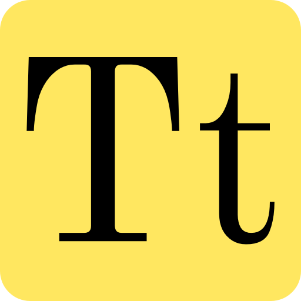

**About me:**

Hello, my name is Abbie and I am a second year Media, Journalism and Publishing student at Oxford Brookes University. I currently prefer publishing and media over journalism and intend to follow a publishing based path through my third year options. 

**About my blog:**

I find the history behind everything we have now really interesting especially when it comes to technology and publishing.  This was why I decided to focus my blog posts around the history of typography, delving into the fonts from thousands of years ago really excites me, from cave paintings to Egyptian hieroglyphics...

The decisions I made for my blog were based around a historical theme, I knew that I needed to keep focused on a certain colour theme - Black, white, browns and greys. Lets start with the page title, I wanted to keep it short and snappy to make it more memorable so stuck with 'Type Time' when deciding on this I broke down the main words 'typography' and 'history', using this as a starting point I listed many possibilities but this combination worked best. Once I had decided on the page title I moved onto my page banner, I knew I was going to keep along the old style so I settled on a textured old style paper background, I then moved onto the text I wanted to layer on top of this I decided on 'Typography through time'. It wasn't until I had written my first post that I had the idea of using a mixture of old and modern typefaces to create a unique banner image.

Moving onto my logo I knew when I had decided on my websites title that I wanted my logo to be based around a clock and time. Due to wanting to create my logo in Adobe Illustrator I knew that the clock would need to be a vector clock so I did some research around this and old style clocks and after many attempts settled on the one pictured below. In the centre of the clock face I used the initials of my title typed in Baskerville Old Face in black. I decided on this font by filtering through the fonts on Illustrator looking at Serif specific fonts and knowing after typing my first few blog posts that Baskerville was a significant typeface in history. For the background colour of the clock face I tried a dew colours but settled on a golden/yellow colour. I then used the solid black lines to create the digits on the clock and decided on a brown background for the whole logo to mimic the traditional style clock.

The favicon for the website is just a simplified version of the logo. I simply just removed the clock face and used the clock face colour as the background with the website initials in a font as similar as I could get to the Baskerville font used on Illustrator. 

As for the selected typefaces for the actual blog content for the website I decided to stick to the theme and use a clear but old fashioned style font throughout in this case, Libre Baskerville.